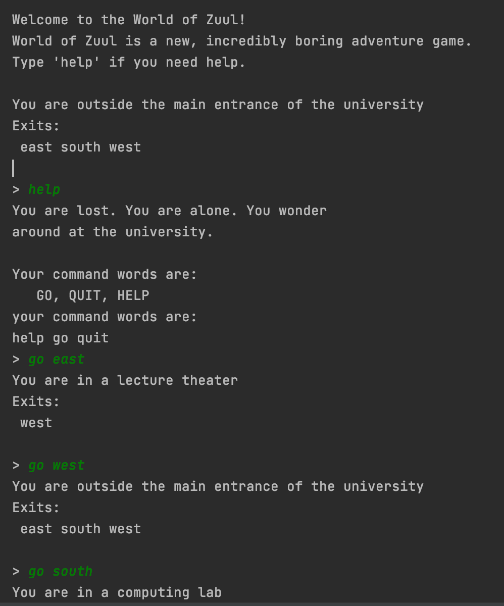
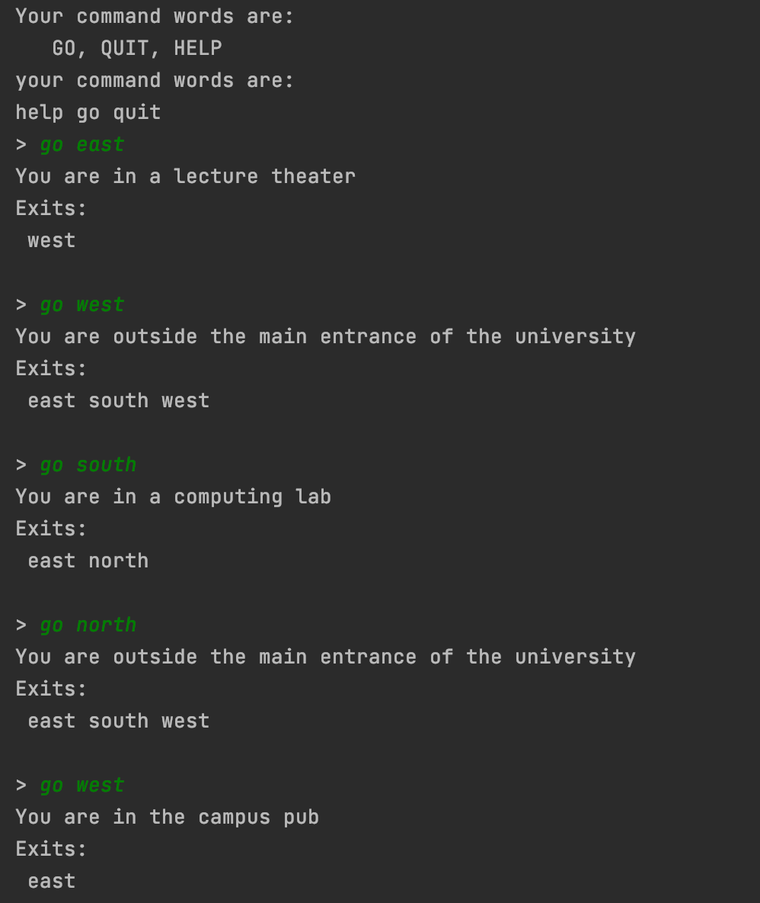
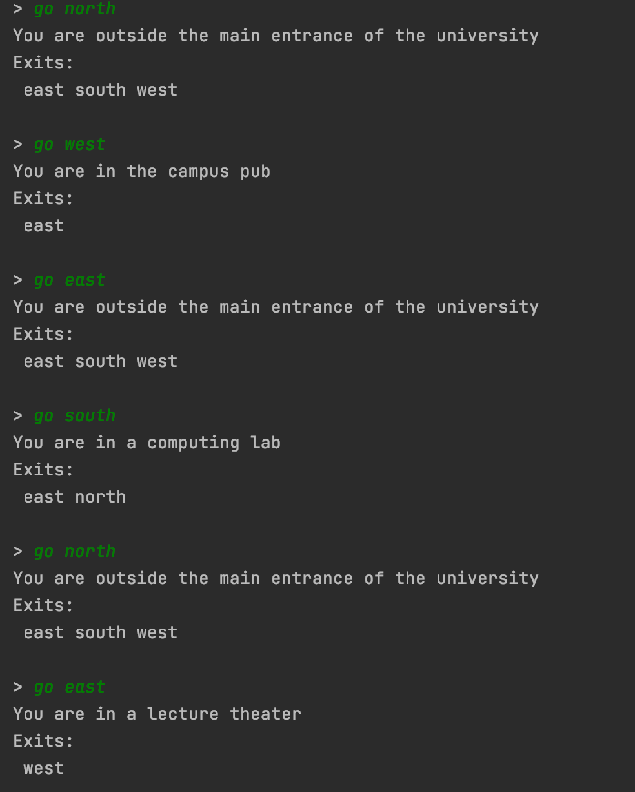
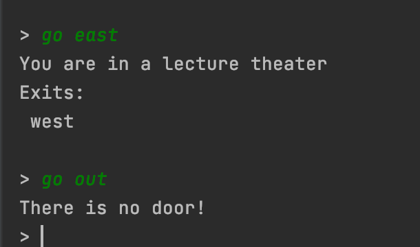
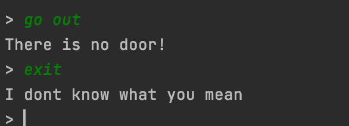
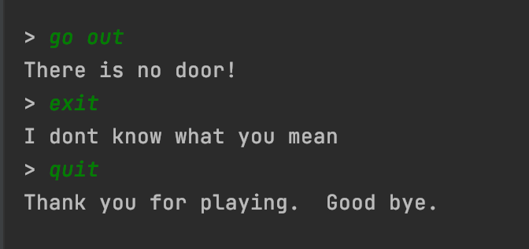

## World of Zuul

## Introduction

"World of Zuul" is a very simple, text based adventure game. 
*   Users can walk around some scenery. That's all. 
    It should really be extended to make it more interesting!
    
## List of Classes and its functions

| List of Classes |
| ------------|
| `1.Game Class`    | 
| `2.Parser`    | 
| `3.Room`    | 
| `4.Command`    | 
| `5.CommandWord`    | 
| `6.CommandWords`    | 

*  The Main class creates and initialises all the others: it creates all
 rooms, creates the parser and starts the game.
* It also evaluates and executes the commands that the parser returns.

CommandWords class holds an enumeration of all command words known to the game.
It is used to recognise commands as they are typed in.

* Parser reads user input and tries to interpret it as an "Adventure"
command. Every time it is called it reads a line from the terminal and
tries to interpret the line as a two word command. It returns the command
as an object of class Command.
* The parser has a set of known command words. It checks user input against
the known commands, and if the input is not one of the known commands, it
returns a command object that is marked as an unknown command.

* Room Class define the exits of this room.  Every direction either leads 
  to another room or is null (no exit there).

## Terminal ScreenShots

  

